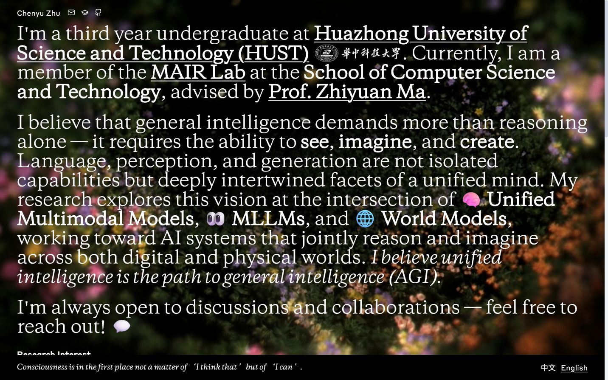
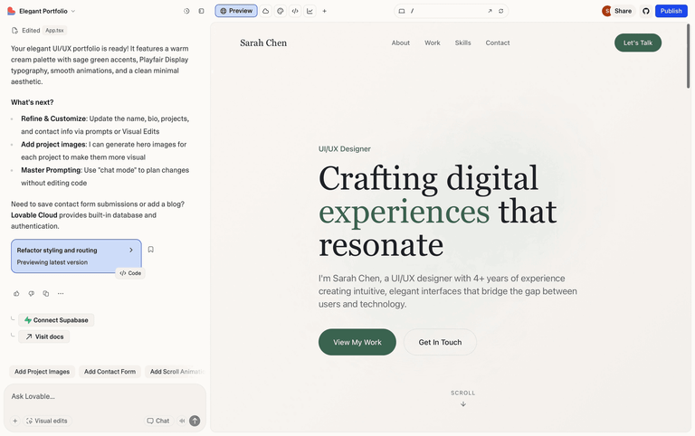
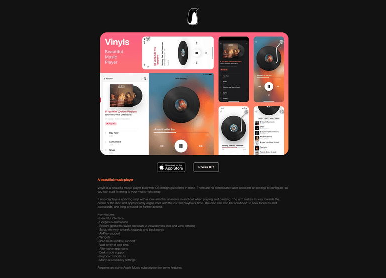
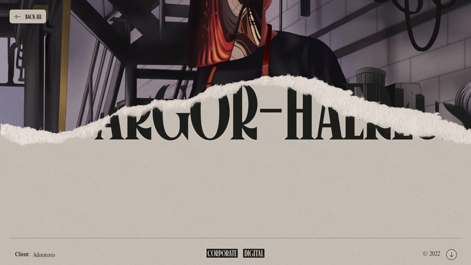

# 设计脑暴：把 ASCII 粒子 MAIR Logo 融入主页

## TL;DR

首选“活体刊头”：把 Canvas 从全屏演示改成首屏中的一块互动编辑插图。它既保留当前视频与大字号研究叙事，又让 MAIR Logo 成为内容的一部分，而不是额外的开场特效。

## Current State


*当前首屏：全幅动态视频、大字号白色衬线正文、固定底部引语。信息密度和视觉强度都已经很高。*

因此，最明显但不合适的做法是：把 ASCII Logo 作为另一个全屏背景直接叠在正文后方。Logo、视频和正文会同时争夺注意力，并削弱研究介绍的可读性。

## Which Ideas to Prototype

| 方案 | 新颖度 | 可行性 | 结论 |
|---|---|---|---|
| 活体刊头 / Living Masthead | 中高 | 高 | **优先原型** |
| 黑场序章 / Research Portal | 高 | 中 | 适合追求第一眼冲击 |
| 粒子章节铰链 / Particle Hinge | 高 | 中高 | 适合建立全站动效语言 |

## The Obvious Approach


*Lovable 示例——姓名、导航、宣言和两个 CTA 的标准作品集 Hero。[Lazyweb]*

你的主页已经明显偏离普通学术模板：它是全屏、编辑式、带视频的研究宣言。Logo 不应把它重新拉回“左文案、右图标”的普通模板，而应延续现有的出版感与章节感。

## 方案一：活体刊头 / Living Masthead（推荐）


*Vinyls——把会动的唱片当作一个明确、受控的媒体对象，而不是铺满背景。[Lazyweb]*

**核心模式：** 像杂志中的主视觉插图、唱片封面或大号首字母一样，把互动 Logo 变成正文版式的一部分。

**应用方式：**

- 首段改成 12 栏编辑网格：左侧 8 栏保留个人介绍，右侧 4 栏放置约 `clamp(260px, 28vw, 420px)` 的黑色 Canvas 窗口。
- 窗口上方可标注 `MAIR / MULTIMODAL AI RESEARCH`，保持你主页现有的出版式小标签语言。
- Logo 默认低频闪烁；指针进入窗口后才启用排斥，离开后回弹。
- 后续两段研究宣言继续全宽排列，不改变现有内容结构。
- 移动端将 Canvas 放在第一段和研究宣言之间，高度约 220px。

```text
┌─────────────────────────────────────────────────────┐
│ Chenyu Zhu  ✉  Scholar  GitHub                      │
├──────────────────────────────┬──────────────────────┤
│ I'm a third year...          │ MAIR / 001           │
│ member of the MAIR Lab...    │   .+#%@@%#+.         │
│                              │  interactive canvas  │
├──────────────────────────────┴──────────────────────┤
│ General intelligence demands more than reasoning... │
└─────────────────────────────────────────────────────┘
```

**为什么适合当前主页：** Logo 紧邻正文中第一次出现的 “MAIR Lab”，语义位置天然；同时不会和视频背景争夺整个屏幕。

**实现边界：** 将现有 Canvas 组件增加 `inline` 模式，移除 `position: fixed`，开放 `cellSize / pushRadius / background` 配置。技术改动最小。

## 方案二：黑场序章 / Research Portal


*Niccol Miranda 项目——标题画面先建立世界观，再通过少量入口动作进入内容。[Lazyweb]*

**核心模式：** 把 Logo 当成进入研究世界的标题画面，而不是主页内容本身。

**应用方式：**

- 首次访问时显示全屏 ASCII Logo 黑场，保留极小的 `ENTER RESEARCH` 与 `SKIP`。
- 用户第一次移动鼠标时，中心字符被推开，Logo 从中心裂开并露出下方现有视频首屏。
- 动画控制在 0.8–1.2 秒；使用 `sessionStorage`，同一会话后续访问直接进入主页。
- `prefers-reduced-motion`、键盘用户和移动端直接淡入，始终提供跳过入口。

```text
┌─────────────────────────────────────────────────────┐
│                                                     │
│                .+#@  MAIR  @#+.                    │
│                                                     │
│          [ ENTER RESEARCH ]        SKIP             │
└─────────────────────────────────────────────────────┘
              ↓ characters split open ↓
┌─────────────────────────────────────────────────────┐
│ Existing video biography hero                       │
└─────────────────────────────────────────────────────┘
```

**优势：** 第一眼最强，能把互动 Logo 的完整效果全部保留。

**风险：** 学术主页的导师、招生委员通常想快速确认研究方向；不可做成必须点击的长期门禁。应是一次性的、可跳过的短序章。Awwwards 也收录了将 Enter Screen 作为独立互动层的案例。[Web]

## 方案三：粒子章节铰链 / Particle Hinge


*Eikon Therapeutics——极少量发光粒子在黑场中承担过场与焦点引导。[Lazyweb]*

**核心模式：** Logo 不固定占据版面，而是成为 About、Research、Publications 等章节之间的转场语法。

**应用方式：**

- 在首屏传记与 `Research Interest` 之间加入一个约 30–38vh 的黑色章节间隔。
- Logo 起初完整；滚动进入该区域时逐渐散开，字符最后排成下一章节标题或编号 `01 / RESEARCH`。
- 点击论文打开详情层时，可复用一次 350–500ms 的粒子展开，随后内容层从下方进入。
- 每个章节只触发一次；返回滚动不重复轰炸。降低动效时直接显示静态分隔线和章节名。

```text
│ end of biography                                     │
├──────────────────────────────────────────────────────┤
│             .+#@ MAIR @#+.                           │
│                scroll ↓                              │
│   .  +   #     01 / RESEARCH     @   .               │
├──────────────────────────────────────────────────────┤
│ Research Interest / Publications                     │
```

**为什么是“铰链”：** 它不抢占已有首屏，而是在信息层级发生变化时出现，帮助访问者感知章节结构。Kode 的博物馆视觉系统也把“运动与变化”延伸到网站滚动体验中，而不只是做一个静态 Logo。[Web]

**实现边界：** 需要一个可受滚动进度控制的 Canvas 状态，以及 `IntersectionObserver`/`requestAnimationFrame` 驱动；比方案一复杂，但容易进一步扩展到论文详情转场。

## Recommendation

先做方案一。它与现有主页的编辑式排版最一致、不会增加访问门槛，也能复用你已经完成的绝大多数 Canvas 代码。如果上线后还希望更有仪式感，再把同一组件扩展为方案三；方案二适合作为特殊版本或作品展示模式，而不是默认长期入口。

## Web References

- [Awwwards — Enter Screen Interaction](https://www.awwwards.com/inspiration/enter-screen-interaction-carl-gordon-portfolio-c-2024)
- [TRY — Kode museum identity and animated website](https://try.no/en/case-studies/ny-merkearkitektur-visuell-identitet-og-nettside)
- [Museum of Contemporary Art Chicago — Logo and Identity](https://mcachicago.org/about/logo-and-identity)
