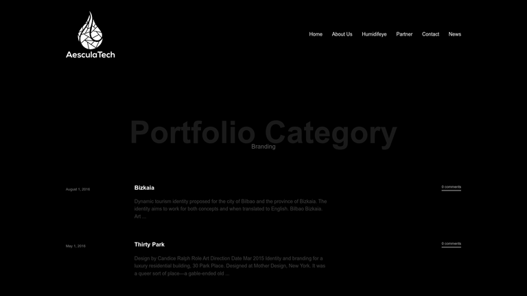
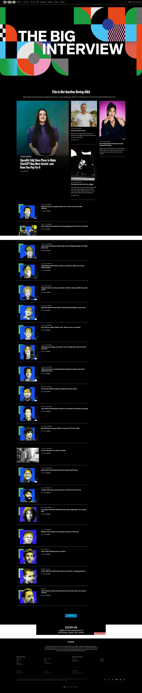
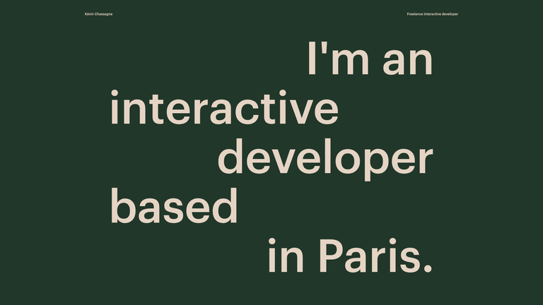

# Design Brainstorm: 用 Pretext 激活学术个人主页

## TL;DR

最值得原型化的不是全站“动态字体”，而是一个研究主题驱动的文字场：About 展开后，研究宣言围绕 **See / Imagine / Create** 三个节点逐行流动。Pretext 负责提前计算每行可用宽度与断行，DOM 只负责语义化渲染和动画。

## Which Ideas to Prototype

| Idea | Novelty | Feasibility | Verdict |
|---|---|---|---|
| 研究宣言绕节点流动 | High | High | Prototype first |
| 折叠栏标题自适应收口 | Medium | High | Add second |
| 论文摘要逐行显影 | Medium | High | Explore |
| 中英文版式连续切换 | High | Medium | Explore |
| 字符化 World Model 背景 | High | Low | Wild card |

## Current Site Fit

当前主页已经采用 Fiona 式整页折叠菜单，并且第一栏带视频背景、栏目可展开、论文条目可悬停预览。Pretext 最适合增强已有的“展开—预览—收起”节奏，不适合再叠加一套常驻的大型动画。

## 1. Research Thesis Field — 首选方案

**The Pattern:** 借鉴动态杂志跨栏排版：每一行根据当前位置拥有不同宽度，文字绕过视觉对象继续流动。

**Applied Here:** About 展开后，将 bio 中的核心句子缩成 60–90 个英文词。三个半透明节点标记 `SEE`、`IMAGINE`、`CREATE`。使用 `prepareWithSegments()` 一次测量文本；每一行调用 `layoutNextLineRange()`，根据该行与节点的相交情况传入不同宽度。节点只做 8–16px 的缓慢位移，文字断行随之平滑更新。

```text
┌──────────────────────────────────────────────────────────┐
│ ABOUT                                      [GitHub] [CV] │
│                                                          │
│  Intelligence must                  ◯ SEE                │
│  do more than reason. It                                  │
│  must perceive, imagine,        ◯ IMAGINE                │
│  and create — as one system.                     ◯ CREATE│
│                                                          │
│  Unified Multimodal Models · World Models · MLLMs        │
└──────────────────────────────────────────────────────────┘
```

**Why it works:** 互动不是装饰；它把“统一感知、想象与生成”这个研究命题直接变成版式行为。

## 2. Accordion Titles That Shrink-Wrap


*竖向作品列表把内容层级压缩成清晰索引；适合映射到当前 Fiona 折叠结构。[Lazyweb]*

当前栏目标题固定占一整行。可用 `measureLineStats()` 对 `Selected Publications`、`Open Source` 等标题做多行 shrink-wrap，让每个折叠栏在不同宽度下都保持紧凑、均衡。展开时标题从索引字重过渡到编辑式标题，但不要逐字弹跳。

```text
ABOUT                              01
SELECTED
PUBLICATIONS                       02
OPEN SOURCE                        03
```

## 3. Publication Abstract as Typography Preview


*大标题与可浏览条目并存，内容本身承担视觉层级。[Lazyweb]*

论文悬停时不只展示图片：用 `layoutWithLines()` 取摘要前 3–5 行，按行宽从短到长显影；关键词如 `diffusion post-training`、`unified multimodal` 保持整块不拆分。离开条目时反向收起。这样即使论文没有 preview 图也仍然有鲜明反馈。

## 4. Bilingual Reflow, Not a Hard Swap

语言切换时先分别 prepare 中英文文本，记录切换前后的行框；用 View Transitions 或 Framer Motion 把旧行过渡到新行。Pretext 支持 CJK 断行，但它不会自动完成“中英文形变”，动画映射仍需应用层实现。

建议只对首屏研究宣言使用，正文继续让浏览器自然排版。这样切换有记忆点，同时保持可访问性和复制能力。

## 5. Wild Card — Typographic World Model


*大尺度文字可成为个人身份的主视觉，但应限制在单一焦点区域。[Lazyweb]*

把低分辨率研究视频或生成图转换成字符密度图，再用 Pretext 的逐字符测量让比例字体也能形成稳定图像。鼠标靠近时字符从图像恢复成论文关键词。

**Upside:** 很强的个人识别度。**Risk:** 容易抢走论文内容的注意力，也会增加 CPU/GPU 与移动端调优成本。因此只适合作为隐藏彩蛋或桌面端短暂片头。

## Minimal Integration Shape

```ts
import {
  prepareWithSegments,
  layoutNextLineRange,
  materializeLineRange,
  type LayoutCursor,
} from '@chenglou/pretext'

await document.fonts.ready
const prepared = prepareWithSegments(text, '400 72px "Copernicus"')

let cursor: LayoutCursor = { segmentIndex: 0, graphemeIndex: 0 }
const lines = []

for (let y = 0; ; y += lineHeight) {
  const maxWidth = widthAvailableAt(y, obstacles)
  const range = layoutNextLineRange(prepared, cursor, maxWidth)
  if (!range) break
  lines.push(materializeLineRange(prepared, range))
  cursor = range.end
}
```

在 React 中应把 `prepareWithSegments()` 放进以 `text + font` 为键的 memo/cache；ResizeObserver 只触发重新 layout。CSS 的真实 `font`、`letter-spacing`、`line-height` 必须与 Pretext 参数一致。

## Guardrails

- Pretext 负责测量与断行，不负责真正绘制字体，也不是 CSS 的全面替代品。
- 等待 `document.fonts.ready` 后再测量，否则自定义字体加载会改变字宽。
- 保留一份真实、连续、可复制的 DOM 文本；Canvas/SVG 只做增强层。
- `prefers-reduced-motion` 下关闭节点移动和逐行动画，回退为普通 CSS 排版。
- 不要给 News、CV、论文全文都上自定义排版；把它限制在 About 宣言与论文 hover preview。
- 先在英文主页验证，因为当前 `content_zh_disabled` 暂未启用；中文方案可在 i18n 内容恢复后加入。

## Sources

- [Pretext repository and API](https://github.com/chenglou/pretext)
- [Official Pretext demos](https://chenglou.me/pretext/)
- [Interactive developer portfolio](https://kevinchassagne.com/)
- [WIRED editorial archive](https://www.wired.com/the-big-interview/)

