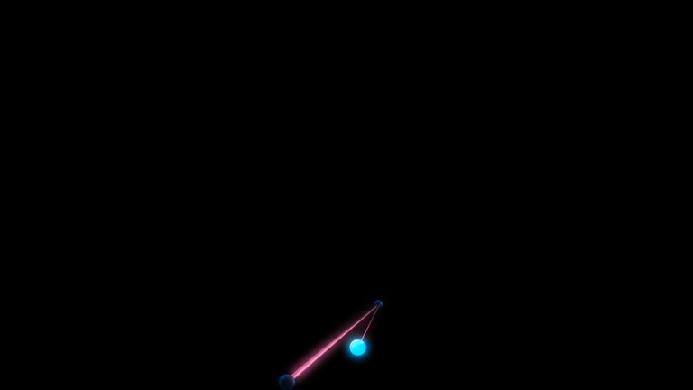
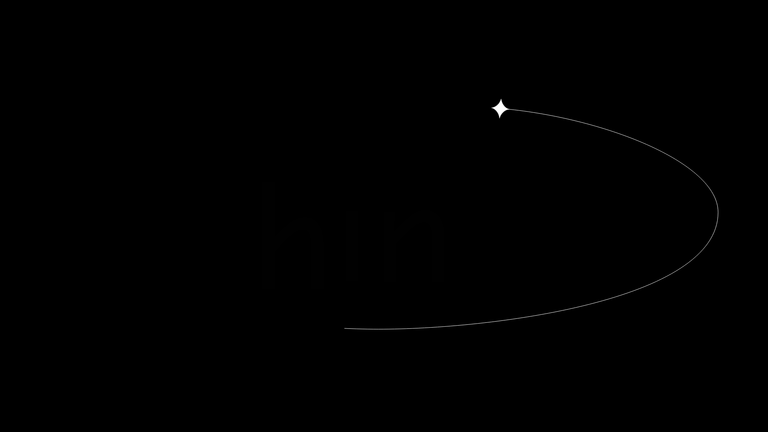

# Quick References: Interactive ASCII Particle Logo

## TL;DR

The strongest direction is a full-screen near-black stage with one centered, luminous identity mark and almost no surrounding interface. Motion should belong to the mark itself, then settle back into a precise silhouette.

## Patterns

1. **Give the identity the whole stage.** The useful references remove navigation, cards, and competing copy from the first viewport.
2. **Keep atmosphere subordinate.** A faint blue-black field can add depth, but the brightest pixels must remain inside the MAIR mark.
3. **Make motion spatially meaningful.** Particle motion reads best when it originates from the identity and returns to a stable anchor instead of drifting forever.
4. **Preserve the source color.** The blue-to-cyan MAIR gradient is more distinctive than a generic white ASCII treatment, so sampled cells should retain local color.

## Proposed composition

```text
+------------------------------------------------------+
|                                                      |
|                                                      |
|                 .+%#@ MAIR @#%+.                    |
|             pointer scatters nearby glyphs           |
|                 spring returns them                  |
|                                                      |
|                                                      |
+------------------------------------------------------+
```

## References

### Pattern A: One luminous interaction on black


*Eikon Therapeutics — a small cyan focal point and a restrained particle trail command an otherwise empty black stage. [Lazyweb]*


*Extraordinary Things — a single white moving mark and orbit line carry the full composition without interface chrome. [Lazyweb]*

These examples support keeping the ASCII logo centered and removing decorative controls from the prototype.

### Pattern B: Low-contrast atmosphere


*Dreamworld — a navy-to-black field and sparse out-of-focus particles add depth while remaining low contrast. [Lazyweb]*

For MAIR, this becomes only a subtle radial blue glow behind the Canvas; the logo itself remains the sole detailed object.

## Implementation cross-check

- [Interactive Particle Logo](https://cssdeck.com/labs/interactive-particle-logo) demonstrates the established image-to-particle Canvas pattern.
- [Proper Noun's Canvas particle-logo walkthrough](https://www.propernoun.co/how-to-make-an-interactive-particle-logo-using-canvas/) independently uses a hidden image as the sampling source and a Canvas as the interaction layer.

## Applied constraints

- Full viewport, near-black background.
- No third-party rendering or physics library.
- MAIR logo cropped from its transparent bounds, sampled into a fixed character grid, and centered responsively.
- Local blue/cyan color retained per sampled cell.
- Pointer repulsion is temporary; spring and damping restore the exact source silhouette.
- Reduced-motion users receive a stable version of the mark.
